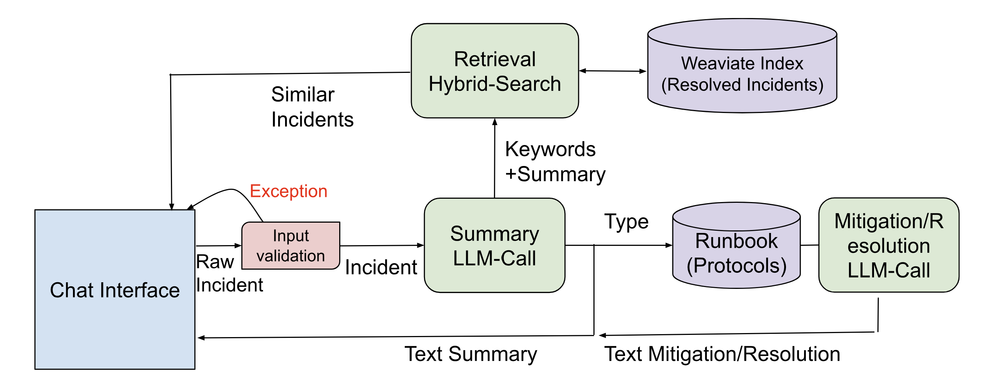

# Automotive Cybersecurity Analyst Copilot (Prototype)

A prototype copilot that:

1. **Summarizes** a security incident report (free text) and extracts structured fields via an LLM (OpenAI-compatible API).
2. **Suggests mitigation** using a mock runbook and a second LLM call.
3. **Retrieves similar incidents** from a Weaviate knowledge base using hybrid (vector + keyword) search.

## Architecture



## Setup

### 1. Python environment

```bash
pip install -r requirements.txt
```

Copy `.env.example` to `.env` and set your API URLs and keys (do not commit `.env`).

### 2. LLM (Stage 1 & 2)

Use any OpenAI-compatible API:

- **VLLM** (e.g. `vllm serve meta-llama/Llama-2-7b-chat-hf`)
- **LMStudio** (start a model and enable the local server)
- Or a proxy to **Claude** / **Gemini** that exposes OpenAI-style chat

Set (or leave defaults):

- `LLM_BASE_URL` — e.g. `http://localhost:8000/v1` for VLLM
- `LLM_API_KEY` — API key if required (use `dummy` for local VLLM/LMStudio)
- `LLM_MODEL` — model name as known by the server

### 3. Embeddings (Stage 3 – RAG)

Weaviate is used with **bring-your-own vectors**: embeddings are produced by an OpenAI-compatible **embedding** endpoint (e.g. VLLM with an embedding model).

- `EMBED_BASE_URL` — embedding API base URL (defaults to `LLM_BASE_URL`)
- `EMBED_API_KEY` — API key if required
- `EMBED_MODEL` — embedding model name (e.g. `BAAI/bge-small-en-v1.5` for VLLM)

### 4. Weaviate

`WEAVIATE_URL` is required. Use either a local Weaviate instance (Docker) or Weaviate Cloud.

**Local (Docker):** Run Weaviate and set `WEAVIATE_URL` to match the host and port:

```bash
docker run -d -p 8081:8080 -p 50051:50051 cr.weaviate.io/semitechnologies/weaviate:latest
```

- `WEAVIATE_URL` — e.g. `http://localhost:8081` (use the host port you map to 8080, e.g. 8081 if 8080 is already in use)

**Weaviate Cloud:** Set `WEAVIATE_URL` and `WEAVIATE_API_KEY`.

On first run, the app creates the `ResolvedTicket` collection (no vectorizer), seeds it with sample tickets (overlapping IPs/usernames for keyword search), and uses your embedding API to vectorize descriptions.

## Usage

```bash
# Report as CLI argument
python main.py "At 14:00 SIEM alerted on multiple failed logins to OTA backend from 10.0.5.12. User svc_ota_prod..."

# Report from file
python main.py --file path/to/incident_report.txt
```

Output is printed in three sections:

- **EXECUTIVE SUMMARY** — from Stage 1 (LLM summary)
- **RECOMMENDED MITIGATION** — from Stage 2 (runbook + LLM)
- **RELEVANT PAST INCIDENTS** — from Stage 3 (Weaviate hybrid search, top 3)

## Project layout

- `config.py` — env-based configuration (LLM, embeddings, Weaviate)
- `prompts.py` — prompt management (summary + mitigation)
- `runbook.py` — mock runbook (5 incident types + “other”)
- `llm_client.py` — OpenAI client, Stage 1 (summary + JSON schema), Stage 2 (mitigation)
- `weaviate_rag.py` — Weaviate schema, seed data, embeddings, hybrid search
- `main.py` — entrypoint: run pipeline and print results

## Stage details

- **Stage 1:** JSON schema for the LLM includes `source`, `affected_services`, `incident_type`, `criticality`, `extracted_keywords`, `summary`. `incident_type` drives runbook lookup; `extracted_keywords` and `summary` are used for RAG.
- **Stage 2:** Runbook is a Python dict keyed by `incident_type`; the relevant guideline is injected into the mitigation prompt and the LLM returns plain-text steps.
- **Stage 3:** Hybrid search uses `summary` + `extracted_keywords` as the query string and the same text embedded for the vector part (`alpha=0.5`). Top 3 results are formatted as: `Ticket ID | Similarity | Resolution`.

## Evaluation

Run the evaluation suite (10 examples, 8 metrics):

```bash
python evaluation.py
```

You can use a **separate LLM for the judge** (LLM-as-judge for correctness/groundedness). Set in `.env` or environment:

- `JUDGE_LLM_BASE_URL` — judge API base URL (defaults to `LLM_BASE_URL`)
- `JUDGE_LLM_API_KEY` — judge API key (defaults to `LLM_API_KEY`)
- `JUDGE_LLM_MODEL` — judge model name (defaults to `LLM_MODEL`)

If unset, the copilot LLM is used for both summarization/mitigation and judging.

At the end of each run, experiment metadata is saved under `evaluation_runs/` with a timestamped JSON file containing: copilot LLM, judge LLM, embedding model, `top_k`, and average scores. Use these files to compare parameters across experiments.
